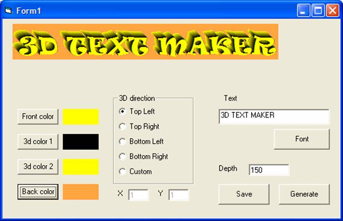



## A 3D Text Maker

### Description

This is a small program that generates 3D text which can be saved into a file. This is the third version and has much cleaner code than number 2 and an extra feature to change the background color. Also there is some new code with the font changing part.

Thanks to sticky for solving the font changing problem which was an annoying feature. I have updated the code with the fix.
 
### More Info
 

             |
---                |---
**Submitted On**   |2005-09-26 12:50:12
**By**             |[jonathan waller](https://github.com/Planet-Source-Code/PSCIndex/blob/master/ByAuthor/jonathan-waller.md)
**Level**          |Beginner
**User Rating**    |5.0 (10 globes from 2 users)
**Compatibility**  |VB 5\.0, VB 6\.0
**Category**       |[Graphics](https://github.com/Planet-Source-Code/PSCIndex/blob/master/ByCategory/graphics__1-46.md)
**World**          |[Visual Basic](https://github.com/Planet-Source-Code/PSCIndex/blob/master/ByWorld/visual-basic.md)
**Archive File**   |[A\_3D\_Text\_1935619262005\.zip](https://github.com/Planet-Source-Code/jonathan-waller-a-3d-text-maker__1-62677/archive/master.zip)

